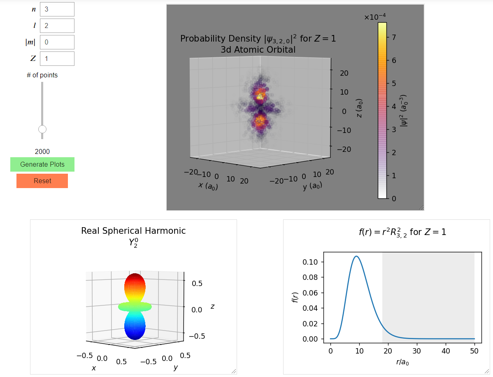

# Orbitals
- Main notebook 
- Documented notebook 

The notebooks are most easily accessible through the Binders above.

Visualizing atomic orbitals using hydrogen-like wave functions.

 
  
 
3dz2 orbital

## Dependencies
- [SymPy](https://www.sympy.org/)
- [MatPlotLib](https://matplotlib.org/)
- [NumPy](https://numpy.org/)

Currently in a Jupyter notebook deriving the wave functions step-by-step using symbolic math.

## Current notebook TODOs
- Mark classically forbidden region on probability density plots
- Smarter "plotting sphere," adjustable?
- More colors
- Power rule color scaling? Would make lower-probability points more visible, making larger orbitals with more radial nodes much more visible.

## Eventual formats
- Standalone python app
- Webapp of some sort?